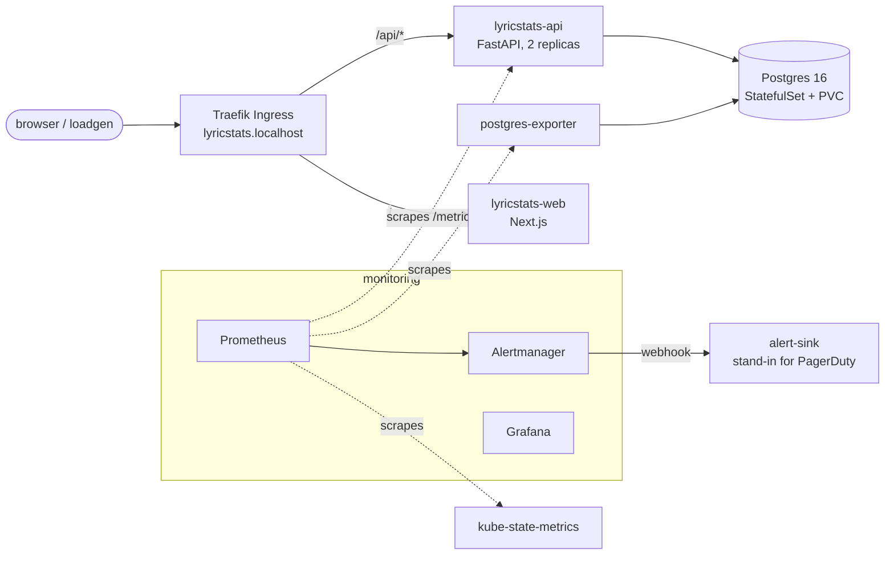

# LyricStats on Kubernetes, with SLOs, alerts and runbooks

LyricStats normally runs on Vercel. This directory runs the same app on a local k3s cluster
the way a platform team would operate it: containerised, monitored against a service level
objective, alerting with runbooks, and broken on purpose to check that all of that works.



## Run it

Needs Docker, [k3d](https://k3d.io), kubectl, helm, and a local copy of `data/lyricstats.db`.

```bash
make -C infra up
```

That creates the cluster, builds and loads the images, installs the monitoring stack, loads
the 2,000 largest artist catalogues into Postgres, and prints the URLs:

| | |
|---|---|
| App | http://lyricstats.localhost:8080 |
| Dashboard | http://grafana.localhost:8080/d/lyricstats-overview |
| Alerts | http://prometheus.localhost:8080/alerts |
| Alertmanager | http://alertmanager.localhost:8080 |

`make -C infra help` lists everything else; `make -C infra down` deletes the cluster.

## What's here

| Path | What it is |
|---|---|
| [`cluster/k3d.yaml`](cluster/k3d.yaml) | Single-node k3s cluster, Traefik exposed on :8080 |
| [`docker/`](docker) | Separate API and web images. Build contexts are allowlists, so `data/` and `.env` files never reach an image |
| [`app/metrics.py`](app/metrics.py) | ASGI middleware exporting request count, errors and latency per route template, with tests. Wraps `backend/main.py` without changing it |
| [`k8s/`](k8s) | Postgres (StatefulSet + PVC), API (2 replicas, probes, PodDisruptionBudget, zero-downtime rollouts), web, Ingress, a synthetic traffic generator, and an alert receiver |
| [`monitoring/values.yaml`](monitoring/values.yaml) | kube-prometheus-stack, trimmed for k3s: scrape jobs and alerts for components k3s doesn't run separately are switched off, so nothing fires that no one can act on |
| [`monitoring/rules.yaml`](monitoring/rules.yaml) | The SLO, recording rules and alerts |
| [`monitoring/dashboards/`](monitoring/dashboards) | Grafana dashboard: user-facing health on top, causes below |
| [`runbooks/`](runbooks) | One page per alert, linked from the alert itself |
| [`drills/`](drills) | Three failure drills: database outage, bad config rollout, out-of-memory |
| [`incidents/`](incidents) | Write-ups of drills that were run, and a template |

## Design decisions

**SLO: 99% of API requests succeed, over 30 days.** 404s for unknown artists are correct
answers, so only 5xx counts. Health checks and metric scrapes are excluded from the ratio.

**Burn-rate alerts instead of "error rate above X%".** A page fires when the error budget
is being spent 14.4 times too fast over both the last 5 minutes and the last hour; a ticket
when it's 6 times too fast over 30 minutes and 6 hours. Brief blips don't page; sustained
problems do, and the alert clears soon after the fix. The cost is slower detection of a
sudden total failure, which is why cause-based alerts (API down, Postgres down, crash
loops) sit next to the SLO alerts.

**An explicit "API down" alert.** The error ratio is computed from requests the API
counted. If no API pod is running, nothing is counted and the ratio is empty rather than
100%, so the SLO alerts can't see a full outage.

**`/health` doesn't check the database.** If it did, a database outage would mark every API
pod unready, and users would get connection errors from the Ingress instead of fast,
explicit 500s. Kubernetes restarting healthy pods wouldn't fix a database either.

**Route templates as metric labels.** `route="/api/artist"`, never the raw URL, so the number
of time series stays fixed however many artists people search for.

**Rollouts can't reduce capacity.** `maxUnavailable: 0` with readiness probes means a release
whose pods never become ready stalls while the old pods keep serving. The bad-config drill
exercises exactly that.

**No secrets in git.** `make secrets` generates the Postgres and Grafana passwords inside the
cluster.

**Least privilege by default.** Every container runs as non-root with a read-only root
filesystem, no Linux capabilities, and the runtime's default seccomp profile.

## Known limitations

- One node, one Postgres instance, no backups: this is a lab, not production.
- The SLIs are measured at the API. Measuring at the Ingress (Traefik metrics) would also
  capture requests that never reach a pod.
- `lyricstats/db.py` creates tables at import time, so an API pod can't start while Postgres
  is down. The database outage drill demonstrates it; the fix is a separate migration step.
